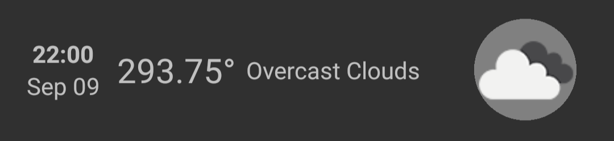

# 1. React Native components and styling

## Key takeaway

- Setup a React Native app
- React Native components:
  - [View](https://reactnative.dev/docs/view)
  - [Text](https://reactnative.dev/docs/text)
  - [FlatList](https://reactnative.dev/docs/flatlist) (important)
  - [Image](https://reactnative.dev/docs/images)
  - [StatusBar](https://reactnative.dev/docs/statusbar)
  - [SafeAreaView (iOS)](https://reactnative.dev/docs/safeareaview)
  - [Button](https://reactnative.dev/docs/text)
- Style with [Flexbox](https://reactnative.dev/docs/flexbox)
- Create custom component
- Install NPM packages:
  - [react-native-fast-image](https://github.com/DylanVann/react-native-fast-image)
  - [react-native-config](https://github.com/luggit/react-native-config)
- Show local and remote images

## Styling

### Create your first style sheet

There are types of styling, static and dynamic. Static styling can be created with `StyleSheet.create`, but this function doesn't have any special caching or performance boost (for now) other than providing types and autocomplete when coding (see its implementation [here](https://github.com/facebook/react-native/blob/17ecae9ce7bded79ab3a083c9d07e15460e5635c/packages/react-native/Libraries/StyleSheet/StyleSheet.js#L366-L378)) so it's the same as:

```tsx
// https://www.typescriptlang.org/docs/handbook/utility-types.html#recordkeys-type
const styles: Record<string, ViewStyle | TextStyle | ImageStyle> = {
  /** Your style here */
};
```

### Android & iOS styling difference

Some components will have different properties base on the platform it is on.

Example: run this snippet in your app or on [Expo Snack](https://snack.expo.dev/) and compare the difference between Android and iOS.

```tsx
import {Text, SafeAreaView, StyleSheet} from 'react-native';

export default function App() {
  return (
    <SafeAreaView style={styles.container}>
      <Text style={styles.text}>Cool text</Text>
    </SafeAreaView>
  );
}

const styles = StyleSheet.create({
  container: {flex: 1, justifyContent: 'center'},
  text: {
    color: 'white',
    textAlign: 'center',
    padding: 8,
    margin: 16,
    backgroundColor: 'blue',
    borderRadius: 24,
  },
});
```

On iOS native text doesn't support `borderRadius` so our blue box won't have rounded corners. Solution: wrap Text inside a generic View component and assign `borderRadius` to it.

```tsx
export default function App() {
  return (
    <SafeAreaView style={styles.container}>
      <View style={styles.textContainer}>
        <Text style={styles.text}>Cool text</Text>
      </View>
    </SafeAreaView>
  );
}

const styles = StyleSheet.create({
  container: {flex: 1, justifyContent: 'center'},
  textContainer: {
    backgroundColor: 'blue',
    borderRadius: 24,
    padding: 8,
    margin: 16,
  },
  text: {color: 'white', textAlign: 'center'},
});
```

### Unlike CSS, style doesn't cascade

Children components don't inherit styles from parent nor ancestor components. Therefore, if `textContainer` have `color: 'white'`, it won't cascade down to `text`.

## Exercise

1. Create `Forecast` component to show [`forecastMock`](./app/models/Forecast.ts) data. Example: 

1. React Native button has limited customization capabilities, build your own button using [Pressable](https://reactnative.dev/docs/pressable). Hint:

- It should inherit props from `Pressable` such as `onPress`, `hitSlop`,...
- `Pressable` doesn't have animation to indicate if it is pressed like `TouchableOpacity`, but `style` and `children` props can accept a function that return styles base on the current state. Add background color or opacity to indicate that the button is pressed.

  ```tsx
  <Pressable
    style={state => ({
      backgroundColor: state.pressed ? 'blue' : 'white',
    })}>
    {state => <Text>{state.pressed ? 'Pressed!' : 'Press Me'}</Text>}
  </Pressable>
  ```

- _(Advanced)_ Add animation using [Animated](https://reactnative.dev/docs/animated) or [react-native-reanimated](https://github.com/software-mansion/react-native-reanimated)
